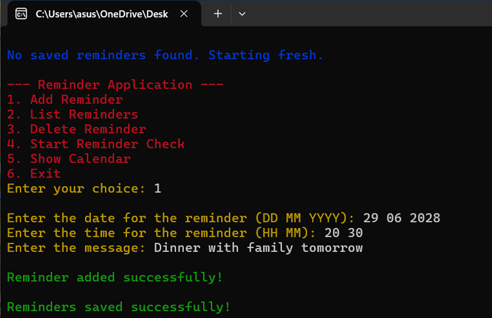
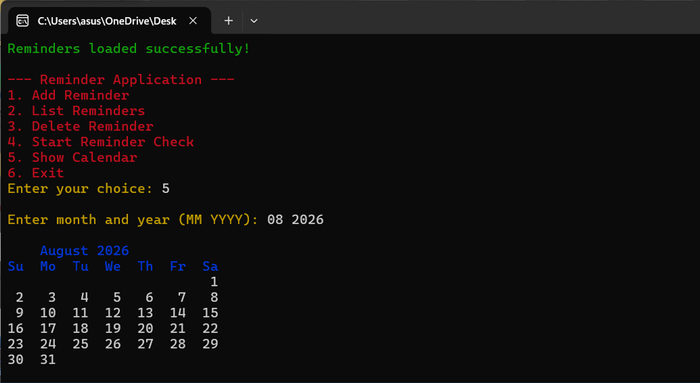
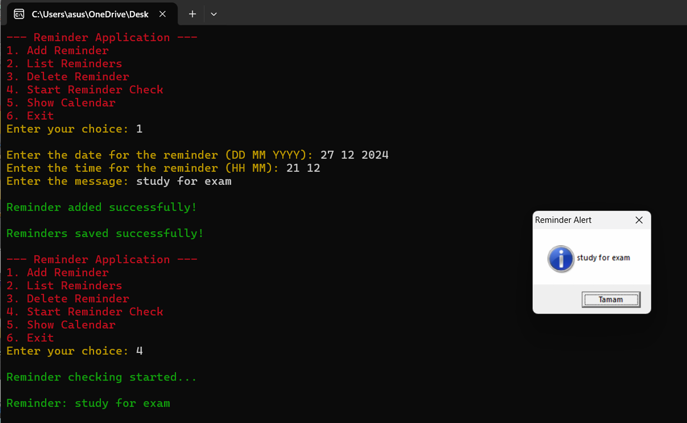

```
 ██████╗ █████╗ ██╗     ███████╗███╗   ██╗██████╗  █████╗ ██████╗      █████╗ ██████╗ ██████╗ 
██╔════╝██╔══██╗██║     ██╔════╝████╗  ██║██╔══██╗██╔══██╗██╔══██╗    ██╔══██╗██╔══██╗██╔══██╗
██║     ███████║██║     █████╗  ██╔██╗ ██║██║  ██║███████║██████╔╝    ███████║██████╔╝██████╔╝
██║     ██╔══██║██║     ██╔══╝  ██║╚██╗██║██║  ██║██╔══██║██╔══██╗    ██╔══██║██╔═══╝ ██╔═══╝ 
╚██████╗██║  ██║███████╗███████╗██║ ╚████║██████╔╝██║  ██║██║  ██║    ██║  ██║██║     ██║     
 ╚═════╝╚═╝  ╚═╝╚══════╝╚══════╝╚═╝  ╚═══╝╚═════╝ ╚═╝  ╚═╝╚═╝  ╚═╝    ╚═╝  ╚═╝╚═╝     ╚═╝     
```
# Calendar App with Reminder Functionality

## Project Description
The **Calendar App** is a lightweight, command-line tool built in the C programming language. It is designed to help users manage their schedules efficiently by providing features such as adding events, viewing a monthly calendar, setting reminders, and editing or deleting events. This project is developed as part of the Introduction to Software Engineering course.

[Click here for the pdf file explaining our project in more detail.](https://github.com/YunuSezer/Calendar-App/blob/main/calender_reminder_app.pdf)

## Installation Instructions
1. Clone the repository from GitHub:
   ```bash
   git clone https://github.com/YunuSezer/Calendar-App
   ```
2. Navigate to the project directory:
   ```bash
   cd calendar-app
   ```
3. Compile the source code using a C compiler (e.g., GCC):
   ```bash
   gcc -o calendar_app main.c
   ```
4. Run the application:
   ```bash
   ./calendar_app
   ```
> [!NOTE]  
> The above instructions is prepared assuming that you are using Windows. You can use the pull request tab for calling help.
   
## Usage Guidelines
- **Add Event**: Add a new event by specifying the date, time, and description.
- **View Calendar**: View the calendar for a specific month, along with listed events.
- **Set Reminder**: Configure a reminder for an event to get notified at the specified time.
- **Edit/Delete Events**: Update or remove existing events from the schedule.
- Follow the on-screen instructions in the command-line interface to navigate the app.

## Team Members
- [Abdulsamet Kocaağa](https://github.com/abdulsametkoccaga) - B2305.090126
- [Bedirhan Dinçer](https://github.com/BedirhanDincer1) - B2305.090121
- [Erdem Doğan](https://github.com/ErdemDogan55) - B2405.090172
- [Muhammed Yiğit Akyüz](https://github.com/Mami122) - B2405.090057
- [Samet Berk Şengönül](https://github.com/sametberksengonul) - B2305.090101
- [Yunus Sezer Örünklü](https://github.com/YunuSezer) - B2405.090072

## Technical Stack
- **Programming Language**: C
- **Development Tools**: GCC (GNU Compiler Collection), Code Blocks
- **Version Control**: Git and GitHub

## Features List
1. Add, edit, and delete events.
2. View the calendar in a monthly format.
3. Set and trigger reminders for events.
4. Persistent data storage using text files.

## Screenshots/Demos
- **Add Event**
  
- **View Calendar**
  
- **Set Reminder** 
  

## Future Improvements
- Add support for more languages.
- Develop a graphical user interface (GUI).
- Run the app in the background with hiding CLI.
- Include cloud storage for data synchronization.
- MacOS support.

